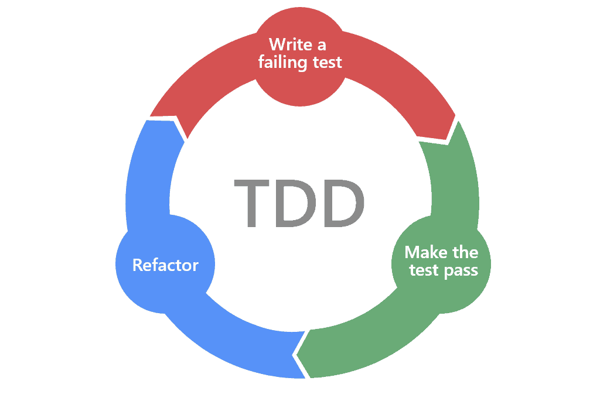
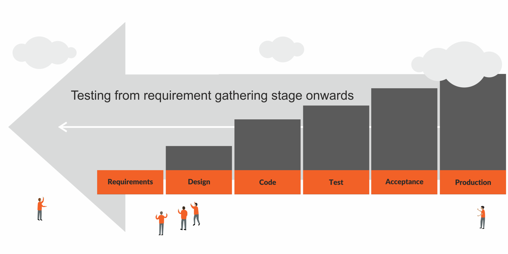

Do i really need tests? Isn't it a waste of time? And other questions like this that you might asked once or still asking yourself. Its not true and let me explain why.

###**TDD - Test Driven Development**

It is a software development process relying on software requirements being converted to test cases before software is fully developed. First write tests that failed, then code to cover them and makes tests green and finally refactor code if its a need to.

###Benefits of having tests

* **Better program design and higher code quality** - Reduces code complexity. Less and more thoughtful dependecies between classes. Smaller classes and functions which are easier to read.

* **Detailed project documentation** - test are really good as a documentation of project. Tests helps deep into project and understande it a bit faster. Especially that it is often a only source of current documentation.

* **Code flexibility and easier maintenance** - feels more confident when comes need to refactor code or add or delete some feature/ parts of code. Teams stay focused on Continuous Delivery

* **Save project costs in the long run** - first thought is that its a bullshit because test take time. Yes and no. It cost but reduce chances of future bugs and issues during development software.
  But if they occure, will be found pretty fast, which also will save money and maybe prevent some more costable bugs.
  This approach is called "Shift-left testing" and its allows to find and prevent defects early in the software delivery process

